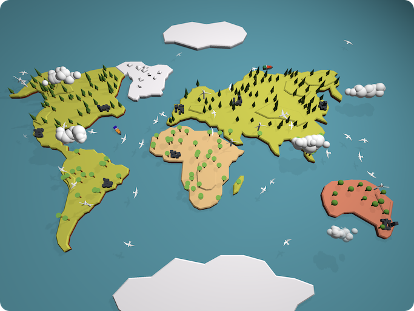

# WWDC 2019 - Saving our Planet

## Introduction

Hello, this is my WWDC 2019 scholarship submission. It's both a game and an interactive simulation showing a lively map of planet Earth. Feel free to have a look and try it out!

## Status

Accepted 🎉

## Gameplay

The second page of the book is the actual game. You can see continents, mountains, cities and trees. There are also birds, airplanes, ships and clouds moving around. More and more bottles and trash piles will appear polluting the environment. Occasionally, container ships have and accident and oil leaks out. Birds and trees begin to disappear and the clouds slowly turn into smog. This development can be stopped by tapping the bottles, trash piles, and oil spills. Sometimes, silhouttes of wind turbines will appear that can be constructed by tapping on them. As you clean up the planet, you can see the environment recover. Your mission is accomplished after constructing at least 6 wind turbines and having cleaned up most of the trash.

## Technologies used

The [Swift Playgrounds](https://www.apple.com/swift/playgrounds/) book is written in [Swift](https://swift.org) 4.2 using [Xcode](https://developer.apple.com/xcode/) 10.1. I made use of [SceneKit](https://developer.apple.com/scenekit/) to render the 3D content. The continents, mountains and ship routes are hand-drawn using [Affinity Designer](https://affinity.serif.com/en-us/designer/) on iPad Pro. All other shapes are written and composed by hand in code.

## How to use

Download [Saving-our-Planet.playgroundbook](Saving-our-Planet.playgroundbook) on your iPad and open it in [Swift Playgrounds](https://www.apple.com/swift/playgrounds/).
